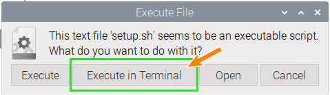
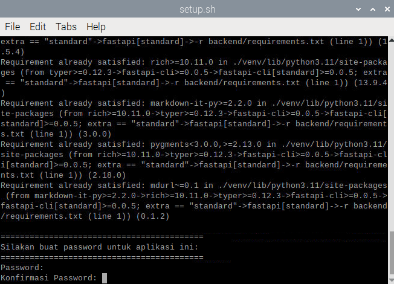
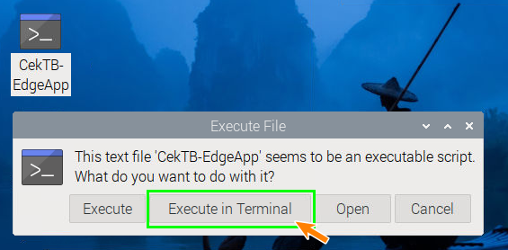
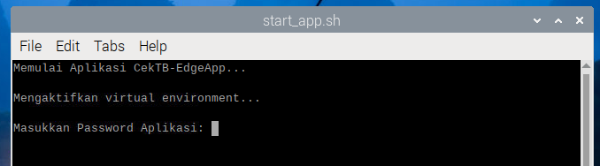

# CekTB - Edge App
(For Raspberry Pi - Raspberry Pi OS)

## --== Selamat datang di Panduan Instalasi CekTB-App ==--
CekTB merupakan layanan terpadu pengecekan skrining cepat untuk keperluan deteksi penyakit Tuberculosis di Indonesia. Aplikasi ini bertujuan untuk dapat dipasang pada Edge Device pelosok negeri agar mempercepat pemerataan layanan kesehatan yang maju.

Aplikasi ini berintegrasi dengan situs pusat [CekTB](https://cektb.click) untuk melakukan sinkronasi data ataupun pembaharuan model kedepannya.

Aplikasi edge ini mengacu pada prinsip _Offline-Fisrt_ atau Utama-Luring sehingga pendeteksian tuberculosis pada daerah 3T (Tertinggal, Terdepan, dan Terluar) yang memiliki keterbatasan akses internet dapat melakukan screening secara luring terlebih dahulu sehingga dapat mempercepat penanganan yang mungkin dapat dilakukan.

## Instalasi
Sebelum menlakukan setup, pastikan perangkat Raspberry Pi telah memiliki python3 dan pip3.

1. Lakukan instalasi mandiri library OpenCV
```
sudo apt-get install -y python3-opencv
```

2. Lakukan installasi mandiri depensi Pillow
```
sudo apt-get install -y libjpeg-dev zlib1g-dev libfreetype6-dev libopenjp2-7
```

3. _Clone_ repository ini
Buka terminal di Raspberry Pi, kemudian masukkan perintah ini untuk melakukan _clone_ repository.
```
git clone https://github.com/srwicak/cektb-edgeapp.git
```

4. Ubah akses pada setup.sh
Setelah selesai masuk ke direktori dari aplikasi dengan 
```
cd cektb-edgeapp
```
Kemudian ubah akses dari setup.sh dengan menjalankan perintah di bawah ini.
```
chmod +x setup.sh
```

5. Jalankan instalasi 
Setelah merubah akses dari setup.sh, bisa menjalankan instalasi dengan perintah di bawah ini.
```
./setup.sh
```
Atau dengan mengklik berkas setup.sh dan memilh "Execute in Terminal".



6. Membuat password aplikasi
Jika Anda ingin memberikan password aplikasi, maka masukkan password dan konfirmasi password. Masukkan pada password tidak akan tampil di layar.
Jika Anda tidak ingin memberikan password untuk membuka aplikasi, maka cukup tekan tombol enter 2 kali.



7. Instalasi selesai
Pastikan instalasi menghasilkan berkas start_app.sh dan _shortcut_ pada _desktop_.

## Persiapan
1. Pastikan Anda memiliki akun di situs pusat [CekTB](https://cektb.click)
2. Masuk ke menu `ML Model` dan unduh model terbaru
3. Setelah diunduh maka masukkan berkas `.tflite` pada folder `data` dari aplikasi ini.

## Cara menjalankan aplikasi
1. Cara menjalankan aplikasi terdapat dua cara, langsung dari _shortcut_ di _dekstop_ atau menekan berkas `start_app.sh` pada folder aplikasi.
2. Kemudian pilih "Execute in Terminal"

3. Masukkan Password dari aplikasi yang telah dibuat sebelumnya.

4. Aplikasi akan membuka browser dan menuju _WebApp_ jika berhasil.

## Cara sinkronasi dengan pusat
1. Pastikan Anda memiliki akun di situs pusat [CekTB](https://cektb.click)
2. Kemudian lakukan pendaftaran perangkat _edge_ pada menu perangkat.
3. Setelah itu salin nilai dari `device_key` ke dalam berkas `data/device_key.json`

## Sidik Gangguan
Jika ada kendala pada numpy, seperti libopenblas.so.0 maka perlu instalasi tambahan library tersebut.
```
sudo apt install libopenblas-dev
```

Apabila ada galat `ERROR:gbm_wrapper.cc` atau `v4l2_utils.cc` merupakan galat dari _graphics backend_ atau _video subsystem_ pada Linux, kemungkinan terkait dengan aplikasi atau lingkungan grafis yang sedang mencoba menggunakan fitur GPU dari TensorFlow (Lite)  di perangkat keras yang tidak memiliki dukungan yang diperlukan atau tidak diatur dengan benar. Hal ini tidak memengaruhi dari program yang dijalankan.

Jika lupa password dari aplikasi, maka lakukan instalasi ulang pada `setup.sh`.